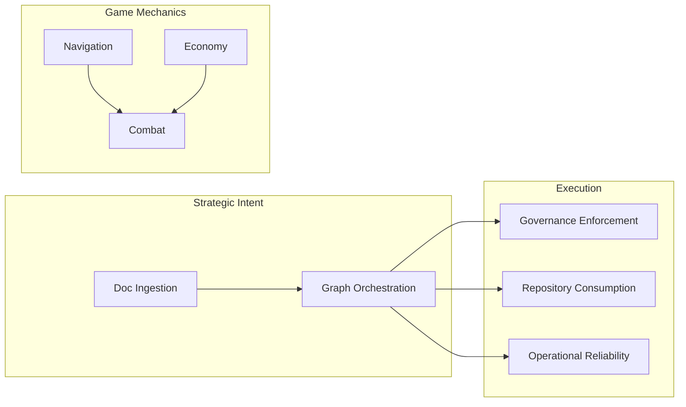

[Home](/) > [Docs](/docs/readme.md) > [Architecture](/docs/architecture/readme.md) > Capability

# Sub-pillar: Capability

Business logic flows and orchestration sequences.

## 1. Core Ingestion & Graph
*Nuance: Primary capabilities for building the Knowledge Graph from raw data.*
- [agent-orchestration](agent-orchestration.md): Context injection and agent behavioral rules.
- **doc-ingestion** *(Planned)*: Physical file processing and validation.

## 2. Game Mechanics
*Nuance: Strategic capabilities governing the Top-Down Space Faring engine.*
- [navigation](navigation.md): Orchestrates Newtonian flight and system transitions.
- [combat](combat.md): Orchestrates projectile dynamics and damage resolution.
- [economy](economy.md): Orchestrates resource flow, faction budgets, and trade.

## 3. Governance & Compliance
*Nuance: Capabilities dedicated to ensuring the repository adheres to its own rules.*
- [governance-enforcement](governance-enforcement.md): Orchestrates protocol and structural compliance audits.

## 3. Consumption & Reliability
*Nuance: Strategic boundary management for external users and production uptime.*
- [repository-consumption](repository-consumption.md): Governs external adoption strategies (Greenfield/Brownfield).
- [operational-reliability](operational-reliability.md): Orchestrates incident response, telemetry, and restoration.
