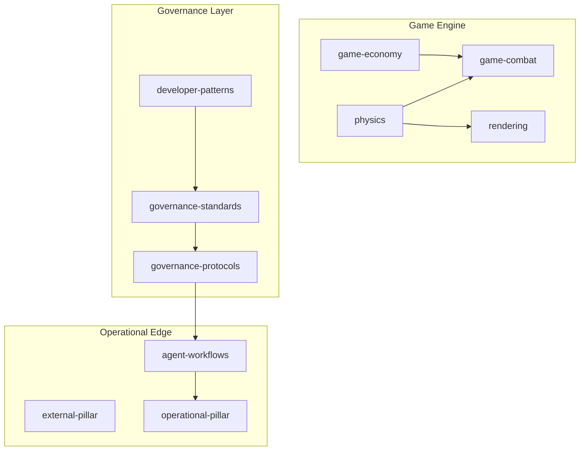

[Home](/) > [Docs](/docs/readme.md) > [Architecture](/docs/architecture/readme.md) > Module

# Sub-pillar: Module

Physical code clusters and implementation mappings.

## 1. Game Engine (C++)
*Nuance: High-performance modules implementing the spatial simulation and interactive systems.*
- [physics](physics.md): Box2D-powered Newtonian physics engine.
- [rendering](src-core.md): SFML rendering pipeline, camera, offscreen indicators.
- [game-combat](game-combat.md): Ship-to-ship engagement and projectile systems.
- [game-economy](game-economy.md): Faction budgeting, trade, and NPC orchestration.
- [system-gate](system-gate.md): Inter-system jump and loading logic.

## 2. Documentation System
*Nuance: Structural modules governing how the repository is organized.*
- [doc-system](doc-system.md): File system structure and DaC engine.
- [ai-config](ai-config.md): Persona behavioral injections.

## 3. Governance Layer
*Nuance: The "Brain" of the repository, defining the rules and protocols.*
- [developer-patterns](developer-patterns.md): Atomic structural definitions.
- [governance-standards](governance-standards.md): Compliance and fitness rules.
- [governance-protocols](governance-protocols.md): Idempotent execution sequences.

## 3. Operational Edge
*Nuance: Automation and response logic for external boundaries and runtime.*
- [agent-workflows](agent-workflows.md): Protocol automation.
- [external-pillar](external-pillar.md): System boundaries and adoption.
- [operational-pillar](operational-pillar.md): Restoration and triage logic.
