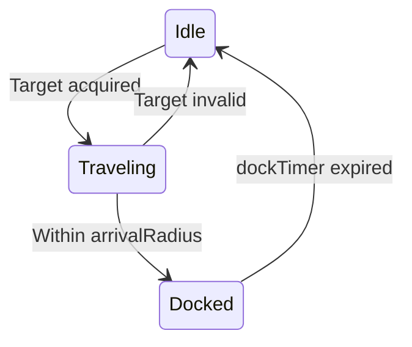

[Home](/) > [Developer](/docs/developer/readme.md) > [Pattern](readme.md) > NPC AI State Machine

# Pattern: NPC AI State Machine

**Intent:** Drive NPC behaviour through a timer-gated decision loop with belief and state enums, spawning at planets and traveling between them.

## Shape

```cpp
struct NPCComponent {
  uint32_t    factionId;
  AIBelief    belief;         // Trader, Escort, Raider
  AIState     state;          // Idle, Docked, Traveling, Combat, Fleeing
  entt::entity targetEntity;
  entt::entity homePlanet;    // Planet of origin
  sf::Vector2f targetPosition;
  float       decisionTimer;
  float       dockTimer;      // Time remaining docked
  float       arrivalRadius;  // 150 units
  float       patrolAngle;    // For escort circular orbit
};

void NPCShipManager::update(registry, dt) {
  // 1. Spawn timer: new ship at random planet every 8s (cap 20)
  // 2. Tick AI state machine for all NPCs
}

void NPCShipManager::tickAI(registry, dt) {
  for (auto [entity, npc, body] : view) {
    switch (npc.state) {
      case Idle:      acquireTarget(npc); break;
      case Traveling: navigateToward(npc, body); break;
      case Docked:    waitOrPatrol(npc, body, dt); break;
    }
  }
}
```

## Key Constraints
- **Planet-based spawning** — Ships spawn at `PlanetEconomy` entity positions, not random coords.
- **Continuous respawn** — Timer spawns 1 ship every 8 seconds, capped at 20 total NPCs.
- **Belief distribution** — 50% Trader, 25% Escort, 25% Raider (random on spawn).
- **State transitions** — `Idle → Traveling → Docked → Idle` loop, with future Combat branching.
- **Physics integration** — Uses `InertialBody` thrust at 50% force, zeroes velocity on dock.

## Belief Behaviors

| Belief | Idle → | Docked behavior | Home planet |
|--------|--------|-----------------|-------------|
| Trader | Pick random planet (exclude home) | Wait 3-6s, reassign home | Updates on dock |
| Escort | Navigate to home planet | Orbit at 200px radius | Static |
| Raider | Pick random planet | Wait 3-6s | Static |

## State Transitions


## Applied In
- `NPCComponent` — Per-entity AI data with `homePlanet` and `dockTimer`.
- `NPCShipManager::tickAI` — State machine and navigation.
- `NPCShipManager::spawnAtRandomPlanet` — Planet-based spawning.
