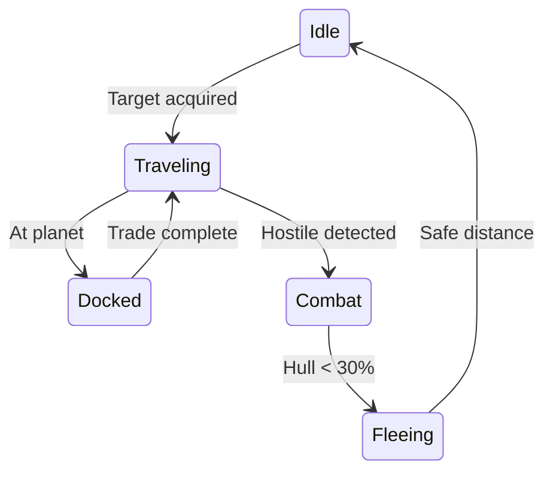

[Home](/) > [Developer](/docs/developer/readme.md) > [Pattern](readme.md) > NPC AI State Machine

# Pattern: NPC AI State Machine

**Intent:** Drive NPC behaviour through a timer-gated decision loop with belief and state enums.

## Shape

```cpp
// Component — carries AI state per entity
struct NPCComponent {
  uint32_t    factionId;
  AIBelief    belief;         // Trader, Escort, Raider
  AIState     state;          // Idle, Docked, Traveling, Combat, Fleeing
  entt::entity targetEntity;
  sf::Vector2f targetPosition;
  float       decisionTimer;  // Seconds until next re-evaluation
};

// System — tick loop
void NPCShipManager::update(registry, dt) {
  for (auto [entity, npc, inertial] : view) {
    npc.decisionTimer -= dt;
    if (npc.decisionTimer <= 0) {
      npc.decisionTimer = 5.0f;  // Re-evaluate every 5s
      acquireTarget(npc, registry);
    }
    navigateToward(npc, inertial);
  }
}
```

## Key Constraints
- **Fixed interval** — Decision logic runs every 5 seconds, not every frame.
- **Belief-state separation** — `AIBelief` defines *role* (permanent), `AIState` defines *activity* (transient).
- **Target acquisition** — Scans all `PlanetEconomy` entities, selects nearest.
- **Physics integration** — Uses `InertialBody` thrust, not direct position manipulation.

## State Transitions (Future)


## Applied In
- `NPCComponent` — Per-entity AI data.
- `NPCShipManager::update` — Decision engine and navigation.
