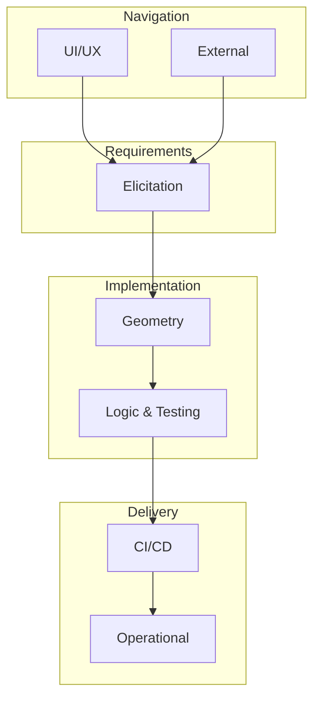

[Home](/) > [Docs](/docs/readme.md) > [Developer](/docs/developer/readme.md) > Pattern

# Sub-pillar: Pattern

Atomic structural definitions for code and documents.

## 1. Elicitation & Requirements
*Nuance: Shapes for transforming vague intent into testable constraints. This is the entry point for all new feature data.*
- [doc-context-elicitation](doc-context-elicitation.md)
- [doc-elicitation-clarity](doc-elicitation-clarity.md)
- [doc-elicitation-exclusivity](doc-elicitation-exclusivity.md)
- [doc-elicitation-traceability](doc-elicitation-traceability.md)
- [doc-elicitation-premise](doc-elicitation-premise.md)
- [doc-elicitation-questioning](doc-elicitation-questioning.md)

> [!TIP]
> **The Bridge:** Requirements patterns define the **Success Criteria** used by the **Testing** patterns to verify the **Logic** implementation.

## 2. Architectural Geometry (T1-T3)
*Nuance: The skeletal structure of the repository. Defines how files are mapped to the Knowledge Graph.*
- [doc-t1-landscape](doc-t1-landscape.md)
- [doc-t2-capability](doc-t2-capability.md)
- [doc-t2-with-code](doc-t2-with-code.md)
- [doc-t3-module](doc-t3-module.md)
- [doc-t3-with-biz-logic](doc-t3-with-biz-logic.md)
- [doc-pillar-ownership](doc-pillar-ownership.md)
- [doc-module-dependency](doc-module-dependency.md)
- [doc-dichotomy](doc-dichotomy.md)

## 3. Logic, Testing & Verification
*Nuance: Rules for code correctness and automated verification.*
- [logic-idempotency](logic-idempotency.md)
- [logic-test-first](logic-test-first.md)
- [test-case-duality](test-case-duality.md)
- [padu-evaluation](padu-evaluation.md)

## 4. CI/CD & Infrastructure
*Nuance: Patterns governing the automated deployment and verification pipeline.*
- [cicd-immutable-artifact](cicd-immutable-artifact.md)
- [cicd-isolated-build](cicd-isolated-build.md)
- [cicd-prioritized-testing](cicd-prioritized-testing.md)
- [cicd-reproducible-build](cicd-reproducible-build.md)
- [cicd-secret-vaulting](cicd-secret-vaulting.md)
- [cicd-test-layering](cicd-test-layering.md)
- [cicd-vulnerability-scan](cicd-vulnerability-scan.md)
- [doc-gov-protocol](doc-gov-protocol.md)
- [doc-gov-standard](doc-gov-standard.md)
- [doc-ext-contract](doc-ext-contract.md)
- [doc-ext-integration](doc-ext-integration.md)

## 5. Operational & Incident Response
*Nuance: High-density artifacts for system uptime, triage, and restoration.*
- [doc-ops-alert](doc-ops-alert.md)
- [doc-ops-span-runbook](doc-ops-span-runbook.md)
- [doc-ops-unified-runbook](doc-ops-unified-runbook.md)
- [doc-ops-restoration-step](doc-ops-restoration-step.md)
- [ops-triage-path](ops-triage-path.md)
- [ops-escalation-path](ops-escalation-path.md)

## 6. Game Engine & Simulation
*Nuance: Shapes for high-performance C++ games, Newtonian physics, and runtime observability.*
- [cpp-ecs-component](cpp-ecs-component.md)
- [cpp-ecs-system-static](cpp-ecs-system-static.md)
- [cpp-singleton-manager](cpp-singleton-manager.md)
- [kinematics-newtonian-2d](kinematics-newtonian-2d.md)
- [rendering-spatial-bridge](rendering-spatial-bridge.md)
- [rendering-offscreen-indicator](rendering-offscreen-indicator.md)
- [rendering-pause-overlay](rendering-pause-overlay.md)
- [rendering-dual-scale](rendering-dual-scale.md)
- [world-procedural-generation](world-procedural-generation.md)
- [npc-ai-state-machine](npc-ai-state-machine.md)
- [npc-fleet-leader-boids](npc-fleet-leader-boids.md)
- [otel-span-instrumentation](otel-span-instrumentation.md)
- [economy-resource-chain](economy-resource-chain.md)
- [economy-dynamic-pricing](economy-dynamic-pricing.md)
- [economy-competitive-market](economy-competitive-market.md)
- [faction-relationship-matrix](faction-relationship-matrix.md)

## 7. UI/UX & Navigation
*Nuance: Patterns for ensuring machine-readability and human scannability.*
- [doc-breadcrumb-navigation](doc-breadcrumb-navigation.md)
- [doc-flat-hierarchy](doc-flat-hierarchy.md)
- [doc-yaml-metadata](doc-yaml-metadata.md)
- [doc-structured-readme](doc-structured-readme.md)
- [signpost-readme](signpost-readme.md)
- [doc-walkthrough](doc-walkthrough.md)
- [ext-greenfield-context](ext-greenfield-context.md)
- [ext-brownfield-context](ext-brownfield-context.md)

## 8. Anti-Patterns (Discouraged)
*Nuance: Forbidden or legacy shapes that trigger audit failures.*
- [doc-directory-nesting](doc-directory-nesting.md)
- [doc-monolithic-wiki](doc-monolithic-wiki.md)
- [doc-narrative-paragraphs](doc-narrative-paragraphs.md)
- [doc-ops-monolithic-runbook](doc-ops-monolithic-runbook.md)
- [doc-ops-unverified-mitigation](doc-ops-unverified-mitigation.md)
- [readme-long-prose](readme-long-prose.md)
