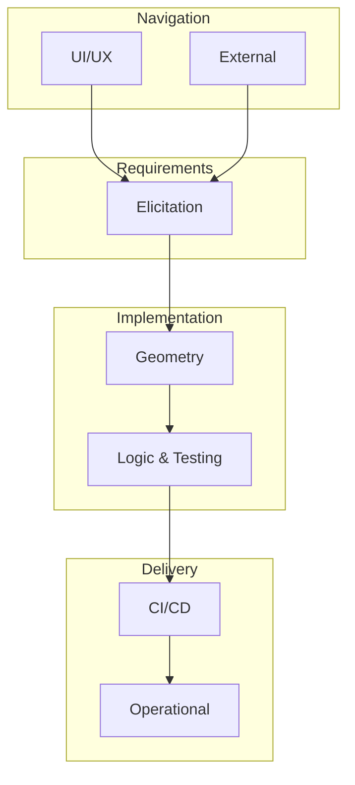

[Home](/) > [Docs](/docs/readme.md) > [Developer](/docs/developer/readme.md) > Pattern

# Sub-pillar: Pattern

Atomic structural definitions for code and documents.


```mermaid
graph TD
    subgraph Requirements
        Eli[Elicitation]
    end
    subgraph Implementation
        Geom[Geometry]
        Logic[Logic & Testing]
    end
    subgraph Delivery
        CICD[CI/CD]
        Ops[Operational]
    end
    subgraph Navigation
        UI[UI/UX]
        Ext[External]
    end

    Eli --> Geom
    Geom --> Logic
    Logic --> CICD
    CICD --> Ops
    UI --> Eli
    Ext --> Eli
```

## 1. Elicitation & Requirements
*Nuance: Shapes for transforming vague intent into testable constraints. This is the entry point for all new feature data.*
- [doc-context-elicitation](doc-context-elicitation.md)
- [doc-elicitation-clarity](doc-elicitation-clarity.md)
- [doc-elicitation-exclusivity](doc-elicitation-exclusivity.md)
- [doc-elicitation-traceability](doc-elicitation-traceability.md)
- [doc-elicitation-premise](doc-elicitation-premise.md)
- [doc-elicitation-questioning](doc-elicitation-questioning.md)

> [!TIP]
> **The Bridge:** Requirements patterns define the **Success Criteria** used by the **Testing** patterns to verify the **Logic** implementation.

## 2. Architectural Geometry (T1-T3)
*Nuance: The skeletal structure of the repository. Defines how files are mapped to the Knowledge Graph.*
- [doc-t1-landscape](doc-t1-landscape.md)
- [doc-t2-capability](doc-t2-capability.md)
- [doc-t2-with-code](doc-t2-with-code.md)
- [doc-t3-module](doc-t3-module.md)
- [doc-t3-with-biz-logic](doc-t3-with-biz-logic.md)
- [doc-pillar-ownership](doc-pillar-ownership.md)
- [doc-module-dependency](doc-module-dependency.md)
- [doc-dichotomy](doc-dichotomy.md)

## 3. Logic, Testing & Verification
*Nuance: Rules for code correctness and automated verification.*
- [logic-idempotency](logic-idempotency.md)
- [logic-test-first](logic-test-first.md)
- [test-case-duality](test-case-duality.md)
- [padu-evaluation](padu-evaluation.md)
- [definition-of-done](definition-of-done.md): Quality gates required before any change is considered complete.
- [trade-static-interface](trade-static-interface.md)
- [cpp-header-hygiene](cpp-header-hygiene.md)
- [cpp-explicit-namespace-resolution](cpp-explicit-namespace-resolution.md)
- [cpp-component-aggregation](cpp-component-aggregation.md)
- [cpp-visibility-promotion](cpp-visibility-promotion.md): Promoting private members for testability.
- [cpp-sdk-type-completion](cpp-sdk-type-completion.md): Managing smart pointer ownership with incomplete implementation types.
- [cpp-centralized-typedefs](cpp-centralized-typedefs.md): Shared game-wide types and typedefs in a common header.
- [cpp-compiler-driven-refactoring](cpp-compiler-driven-refactoring.md): Using the compiler as source of truth during structural changes.
- [cpp-component-registration](cpp-component-registration.md): Explicit registration of every new `.cpp` file in CMakeLists.txt.
- [cpp-external-api-facade](cpp-external-api-facade.md): Isolating third-party types behind a facade.
- [cpp-header-resilience](cpp-header-resilience.md): Explicit inclusion to prevent brittle transitive dependencies.
- [cpp-interface-segregation](cpp-interface-segregation.md): Depending on the least-privileged generic interface.
- [cpp-standard-alignment](cpp-standard-alignment.md): Enforcing consistent C++ standard across compiler and linter.
- [cpp-structural-integrity](cpp-structural-integrity.md): Preventing scope leakage and API mismatches during large refactors.
- [cpp-type-safe-handles](cpp-type-safe-handles.md): Strong typedefs over raw integer IDs and void pointers.
- [encapsulated-state-mutation](encapsulated-state-mutation.md): State changes through verified API methods, not direct member access.
- [entt-reference-safety](entt-reference-safety.md): Re-fetching component references after registry mutations.
- [explicit-module-identity](explicit-module-identity.md): Requiring explicit identities (names) for processable objects.
- [full-dependency-initialization](full-dependency-initialization.md): Initializing all mandatory context components to avoid silent escapes.
- [proxy-identity-overlap](proxy-identity-overlap.md): Avoiding shared faction/relationship IDs in isolated tests.
- [silent-logic-bypass](silent-logic-bypass.md): Default-initialized objects that silently skip logic checks.
- [single-source-calculation](single-source-calculation.md): Deriving and storing values in exactly one location.
- [reactive-state-access](reactive-state-access.md): Querying source-of-truth components rather than cached copies.
- [unified-unit-representation](unified-unit-representation.md): Consistent system units (e.g., Days for TTE) across code and tests.
- [component-driven-initialization](component-driven-initialization.md): Initializing source components rather than summary fields.

## 4. CI/CD & Infrastructure
*Nuance: Patterns governing the automated deployment and verification pipeline.*
- [cicd-immutable-artifact](cicd-immutable-artifact.md)
- [cicd-isolated-build](cicd-isolated-build.md)
- [cicd-prioritized-testing](cicd-prioritized-testing.md)
- [cicd-reproducible-build](cicd-reproducible-build.md)
- [cicd-secret-vaulting](cicd-secret-vaulting.md)
- [cicd-test-layering](cicd-test-layering.md)
- [cicd-vulnerability-scan](cicd-vulnerability-scan.md)
- [cicd-shadow-build](cicd-shadow-build.md): Out-of-tree builds for permission resilience.
- [cicd-fetchcontent-dependency](cicd-fetchcontent-dependency.md): Automated dependency acquisition.
- [cicd-hybrid-dependency-acquisition](cicd-hybrid-dependency-acquisition.md): Prioritizing local dependencies with automated remote fallback.
- [doc-gov-protocol](doc-gov-protocol.md)
- [doc-gov-standard](doc-gov-standard.md)
- [doc-ext-contract](doc-ext-contract.md)
- [doc-ext-integration](doc-ext-integration.md)
- [docker-host-isolation](docker-host-isolation.md): Container network and resource isolation.
- [docker-kitware-cmake](docker-kitware-cmake.md): Pinned CMake installation from Kitware APT.
- [docker-multi-stage-build](docker-multi-stage-build.md): Multi-stage Docker builds for optimized images.
- [docker-service-healthcheck](docker-service-healthcheck.md): Health probes for container service readiness.
- [docker-shared-library-enforcement](docker-shared-library-enforcement.md): Enforcing shared library resolution in containers.
- [docker-source-build](docker-source-build.md): Building dependencies from source for versioning control.
- [docker-transitive-dependency-management](docker-transitive-dependency-management.md): Managing transitive runtime library dependencies in containers.

## 5. Operational & Incident Response
*Nuance: High-density artifacts for system uptime, triage, and restoration.*
- [doc-ops-alert](doc-ops-alert.md)
- [doc-ops-span-runbook](doc-ops-span-runbook.md)
- [doc-ops-unified-runbook](doc-ops-unified-runbook.md)
- [doc-ops-restoration-step](doc-ops-restoration-step.md)
- [doc-ops-diagnostic-dashboard](doc-ops-diagnostic-dashboard.md): Structured definition of SigNoz operational dashboards.
- [ops-triage-path](ops-triage-path.md)
- [ops-escalation-path](ops-escalation-path.md)
- [ops-scoped-resource-discovery](ops-scoped-resource-discovery.md): Progressive search strategy to avoid permission flakes.

## 6. Game Engine & Simulation
*Nuance: Shapes for high-performance C++ games, Newtonian physics, and runtime observability.*
- [cpp-ecs-component](cpp-ecs-component.md)
- [cpp-ecs-system-static](cpp-ecs-system-static.md)
- [cpp-singleton-manager](cpp-singleton-manager.md)
- [kinematics-newtonian-2d](kinematics-newtonian-2d.md)
- [rendering-spatial-bridge](rendering-spatial-bridge.md)
- [rendering-offscreen-indicator](rendering-offscreen-indicator.md)
- [rendering-pause-overlay](rendering-pause-overlay.md)
- [unified-slot-system](unified-slot-system.md)
- [unified-unit-representation](unified-unit-representation.md)
- [rate-based-consumption-scaling](rate-based-consumption-scaling.md)
- [fleet-wide-resource-aggregation](fleet-wide-resource-aggregation.md)
- [greedy-fitness-generation-retry](greedy-fitness-generation-retry.md)
- [rendering-dual-scale](rendering-dual-scale.md)
- [world-procedural-generation](world-procedural-generation.md)
- [npc-ai-state-machine](npc-ai-state-machine.md): Finite state machine for behavioral orchestration.
- [npc-fleet-leader-boids](npc-fleet-leader-boids.md)
- [otel-span-instrumentation](otel-span-instrumentation.md)
- [economy-resource-chain](economy-resource-chain.md)
- [economy-dynamic-pricing](economy-dynamic-pricing.md): Supply/demand based price formulas.
- [economy-competitive-market](economy-competitive-market.md): Faction bid model for tiered vessels.
- [economy-infrastructure-expansion](economy-infrastructure-expansion.md): Autonomous factory construction.
- [dna-weighted-infrastructure-expansion](dna-weighted-infrastructure-expansion.md): Biasing factory choice by strategic axis.
- [faction-relationship-matrix](faction-relationship-matrix.md)
- [ship-modular-composition](ship-modular-composition.md): Composition of hulls and specific module layout.
- [procedural-hull-generation](procedural-hull-generation.md): Role-based construction of vessel geometries.
- [faction-dna-genetic-profile](faction-dna-genetic-profile.md): Strategic axis weights for procedural behavior.
- [evolutionary-strategy-drift](evolutionary-strategy-drift.md): Stochastic DNA mutation based on performance metrics.
- [mission-performance-feedback-loop](mission-performance-feedback-loop.md): Tracking kills/losses to drive evolutionary fitness.
- [centralized-entity-lookup](centralized-entity-lookup.md): Cross-class delegation of canonically unique entity lookups to a shared utility.
- [housekeeping-encapsulation](housekeeping-encapsulation.md): Intra-class extraction of repeated setup and refresh logic into named private methods.
- [blueprint-round-trip](blueprint-round-trip.md): Symmetry requirement between `applyBlueprint` and `blueprintFromEntity`.
- [boarding-protocol](boarding-protocol.md): Rules for ship-to-ship resource transfer and fleet joining.
- [attribute-differentiated-recipes](attribute-differentiated-recipes.md): Recipes differentiated by module attribute tiers.
- [economy-faction-standards](economy-faction-standards.md): Faction production standards and scrapyard mechanics.
- [economy-market-structure](economy-market-structure.md): Physical ship inventory and market listing structure.
- [economy-refit-fee](economy-refit-fee.md): Installation credit costs for player refitting.
- [tiered-utility-allocation](tiered-utility-allocation.md): Slot and resource allocation by tier for ship balance.
- [trade-tabbed-interface](trade-tabbed-interface.md): Tabbed panel UI for commodity and module trading.
- [unified-slot-system](unified-slot-system.md): Positional role assignment in HullDef slot definitions.

## 7. UI/UX & Navigation
*Nuance: Patterns for ensuring machine-readability and human scannability.*
- [doc-breadcrumb-navigation](doc-breadcrumb-navigation.md)
- [doc-flat-hierarchy](doc-flat-hierarchy.md)
- [doc-yaml-metadata](doc-yaml-metadata.md)
- [doc-structured-readme](doc-structured-readme.md)
- [signpost-readme](signpost-readme.md)
- [doc-walkthrough](doc-walkthrough.md)
- [ext-greenfield-context](ext-greenfield-context.md)
- [ext-brownfield-context](ext-brownfield-context.md)
- [ui-context-injection](ui-context-injection.md): State provided via context struct to UI panels.
- [rendering-scrollable-subpanel](rendering-scrollable-subpanel.md): Key-driven scrolling for detail panes.
- [rendering-schematic-visuals](rendering-schematic-visuals.md): Blueprint outline rendering in schematic mode.
- [ui-component-guard](ui-component-guard.md): Resilient `try_get` access for optional UI components.

## 8. Anti-Patterns (Discouraged)
*Nuance: Forbidden or legacy shapes that trigger audit failures.*
- [doc-directory-nesting](doc-directory-nesting.md)
- [doc-monolithic-wiki](doc-monolithic-wiki.md)
- [doc-narrative-paragraphs](doc-narrative-paragraphs.md)
- [doc-ops-monolithic-runbook](doc-ops-monolithic-runbook.md)
- [doc-ops-unverified-mitigation](doc-ops-unverified-mitigation.md)
- [readme-long-prose](readme-long-prose.md)
- [ghost-logic](ghost-logic.md): Duplicate inline lookups or component aggregation spread across multiple files.

### Index Map
```yaml
index_map:
  Elicitation: [doc-context-elicitation, doc-elicitation-clarity, doc-elicitation-exclusivity, doc-elicitation-traceability, doc-elicitation-premise, doc-elicitation-questioning]
  Geometry: [doc-t1-landscape, doc-t2-capability, doc-t2-with-code, doc-t3-module, doc-t3-with-biz-logic, doc-pillar-ownership, doc-module-dependency, doc-dichotomy]
  Logic: [logic-idempotency, logic-test-first, test-case-duality, padu-evaluation, trade-static-interface, cpp-header-hygiene, cpp-explicit-namespace-resolution, cpp-component-aggregation, cpp-visibility-promotion, cpp-sdk-type-completion]
  CICD: [cicd-immutable-artifact, cicd-isolated-build, cicd-prioritized-testing, cicd-reproducible-build, cicd-secret-vaulting, cicd-test-layering, cicd-vulnerability-scan, cicd-shadow-build, cicd-fetchcontent-dependency, cicd-hybrid-dependency-acquisition, doc-gov-protocol, doc-gov-standard, doc-ext-contract, doc-ext-integration]
  Ops: [doc-ops-alert, doc-ops-span-runbook, doc-ops-unified-runbook, doc-ops-restoration-step, ops-triage-path, ops-escalation-path, ops-scoped-resource-discovery]
  Logic: [logic-idempotency, logic-test-first, test-case-duality, padu-evaluation, definition-of-done, trade-static-interface, cpp-header-hygiene, cpp-explicit-namespace-resolution, cpp-component-aggregation, cpp-visibility-promotion, cpp-sdk-type-completion, cpp-centralized-typedefs, cpp-compiler-driven-refactoring, cpp-component-registration, cpp-external-api-facade, cpp-header-resilience, cpp-interface-segregation, cpp-standard-alignment, cpp-structural-integrity, cpp-type-safe-handles, encapsulated-state-mutation, entt-reference-safety, explicit-module-identity, full-dependency-initialization, proxy-identity-overlap, silent-logic-bypass, single-source-calculation, reactive-state-access, unified-unit-representation, component-driven-initialization]
  CICD: [cicd-immutable-artifact, cicd-isolated-build, cicd-prioritized-testing, cicd-reproducible-build, cicd-secret-vaulting, cicd-test-layering, cicd-vulnerability-scan, cicd-shadow-build, cicd-fetchcontent-dependency, cicd-hybrid-dependency-acquisition, doc-gov-protocol, doc-gov-standard, doc-ext-contract, doc-ext-integration, docker-host-isolation, docker-kitware-cmake, docker-multi-stage-build, docker-service-healthcheck, docker-shared-library-enforcement, docker-source-build, docker-transitive-dependency-management]
  Ops: [doc-ops-alert, doc-ops-span-runbook, doc-ops-unified-runbook, doc-ops-restoration-step, doc-ops-diagnostic-dashboard, ops-triage-path, ops-escalation-path, ops-scoped-resource-discovery]
  Engine: [cpp-ecs-component, cpp-ecs-system-static, cpp-singleton-manager, kinematics-newtonian-2d, rendering-spatial-bridge, rendering-offscreen-indicator, rendering-pause-overlay, rendering-dual-scale, world-procedural-generation, npc-ai-state-machine, npc-fleet-leader-boids, otel-span-instrumentation, economy-resource-chain, economy-dynamic-pricing, economy-competitive-market, economy-infrastructure-expansion, dna-weighted-infrastructure-expansion, faction-relationship-matrix, ship-modular-composition, procedural-hull-generation, faction-dna-genetic-profile, evolutionary-strategy-drift, mission-performance-feedback-loop, centralized-entity-lookup, housekeeping-encapsulation, blueprint-round-trip, boarding-protocol, attribute-differentiated-recipes, economy-faction-standards, economy-market-structure, economy-refit-fee, tiered-utility-allocation, trade-tabbed-interface, unified-slot-system]
  UX: [doc-breadcrumb-navigation, doc-flat-hierarchy, doc-yaml-metadata, doc-structured-readme, signpost-readme, doc-walkthrough, ext-greenfield-context, ext-brownfield-context, ui-context-injection, rendering-scrollable-subpanel, rendering-schematic-visuals, ui-component-guard]
  AntiPatterns: [doc-directory-nesting, doc-monolithic-wiki, doc-narrative-paragraphs, doc-ops-monolithic-runbook, doc-ops-unverified-mitigation, readme-long-prose, ghost-logic]
```
