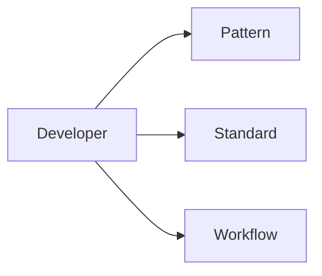

[Home](/) > Developer

# Pillar: Developer

Shapes, rules, and human processes for building and maintaining the system.



## Sub-directories
- [pattern/](pattern/): Contextless definitions of code and document geometry.
- [standard/](standard/): PADU matrices rating patterns for operations.
- [workflow/](workflow/): Human-centric guides for the SDLC.

---
## Machine Navigation Metadata
```yaml
type: directory_manifest
pillar: developer
index_map:
  pattern:
    path: pattern/
    scope: Atomic structural definitions.
  standard:
    path: standard/
    scope: Pattern application ratings.
  workflow:
    path: workflow/
    scope: SDLC process guides.
```
