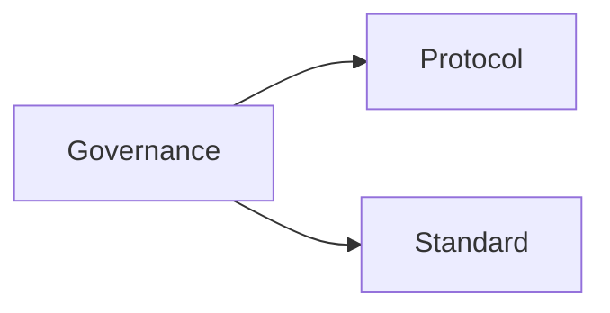

[Home](/) > [Docs](/docs/readme.md) > Governance

# Pillar: Governance

Meta-rules and idempotent entry points for agents to modify or audit the system.



## Sub-directories
- [protocol/](protocol/): Step-by-step execution scripts for system modification.
- [standard/](standard/): Global constraints and pattern ratings.

---
## Machine Navigation Metadata
```yaml
type: directory_manifest
pillar: governance
index_map:
  protocol:
    path: protocol/
    scope: Step-by-step execution scripts.
  standard:
    path: standard/
    scope: Global repository constraints.
```
