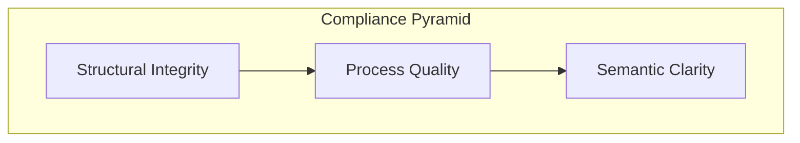

[Home](/) > [Docs](/docs/readme.md) > [Governance](/docs/governance/readme.md) > Standard

# Sub-pillar: Standard

Global repository constraints and architectural rules.

## 1. Structural Integrity (Foundation)
*Nuance: Standards governing the physical and logical organization of knowledge. Mandatory for all pillars.*
- [arch-documentation](arch-documentation.md): T1-T3 mapping rules.
- [document-organization](document-organization.md): Metadata and hierarchy rules.
- [document-topologies](document-topologies.md): Cross-pillar linkage rules.

## 2. Process Quality (Action)
*Nuance: Standards governing runtime and CI/CD operations.*
- [cicd-pipeline](cicd-pipeline.md): Deployment and quality gates.
- [ops-documentation](ops-documentation.md): Restoration and triage guidelines.
- [protocol-execution](protocol-execution.md): Rules for valid agent-led operations.

## 3. Semantic Clarity (Intent)
*Nuance: Standards for capturing intent and nuance before implementation.*
- [context-elicitation](context-elicitation.md): Requirement discovery and boundary definition.

## 4. Game Engine (Domain-Specific)
*Nuance: Standards governing the C++ game engine technology choices and ECS patterns.*
- [game-tech-stack](game-tech-stack.md): Approved libraries, physics engine, ECS, and economy patterns.
