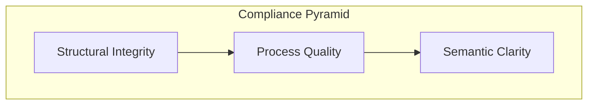

[Home](/) > [Docs](/docs/readme.md) > [Governance](/docs/governance/readme.md) > Standard

# Sub-pillar: Standard

Global repository constraints and architectural rules.

```mermaid
graph TD
    subgraph Compliance Pyramid
        Base[Structural Integrity]
        Mid[Process Quality]
        Top[Semantic Clarity]
    end

    Base --> Mid
    Mid --> Top
```

## 1. Structural Integrity (Foundation)
*Nuance: Standards governing the physical and logical organization of knowledge. Mandatory for all pillars.*
- [arch-documentation](arch-documentation.md): T1-T3 mapping rules.
- [document-organization](document-organization.md): Metadata and hierarchy rules.
- [document-topologies](document-topologies.md): Cross-pillar linkage rules.
- [header-management](header-management.md): IWYU and include rules.
- [cmake-registration-consistency](cmake-registration-consistency.md): CMake source listing and target registration.
- [cpp-incomplete-type-resolution](cpp-incomplete-type-resolution.md): Resolving incomplete type errors in C++ headers.
- [cpp-test-visibility](cpp-test-visibility.md): Ensuring test targets can access non-public symbols.
- [cpp-code-quality](cpp-code-quality.md): Foundational C++ structural, syntactic, type-safety, and modularity choices.

## 2. Process Quality (Action)
*Nuance: Standards governing runtime and CI/CD operations.*
- [cicd-pipeline](cicd-pipeline.md): Deployment and quality gates.
- [ops-documentation](ops-documentation.md): Restoration and triage guidelines.
- [protocol-execution](protocol-execution.md): Rules for valid agent-led operations.
- [observability-standard](observability-standard.md): Telemetry naming and documentation rules.
- [build-resilience](build-resilience.md): Approved build strategies and fallback patterns.
- [build-env-mac-restriction](build-env-mac-restriction.md): Network-isolated build fallback for macOS.
- [docker-orchestration](docker-orchestration.md): Container orchestration and service coordination.
- [agent-orchestration-standard](agent-orchestration-standard.md): PADU ratings for AI agent workflow patterns.

## 3. Semantic Clarity (Intent)
*Nuance: Standards for capturing intent and nuance before implementation.*
- [context-elicitation](context-elicitation.md): Requirement discovery and boundary definition.

## 4. Game Engine (Domain-Specific)
*Nuance: Standards governing the C++ game engine technology choices and ECS patterns.*
- [game-tech-stack](game-tech-stack.md): Approved libraries, physics engine, ECS, and economy patterns.
- [logic-encapsulation-standard](logic-encapsulation-standard.md): PADU ratings for intra-class housekeeping and cross-class entity lookup patterns.
- [logic-test-integrity](logic-test-integrity.md): Fitness ratings for core game logic patterns and unit test shapes.
- [state-synchronization](state-synchronization.md): PADU ratings for maintaining consistent state across distributed components.
- [ui-pattern-rating](ui-pattern-rating.md): PADU ratings for UI rendering and interaction patterns.
