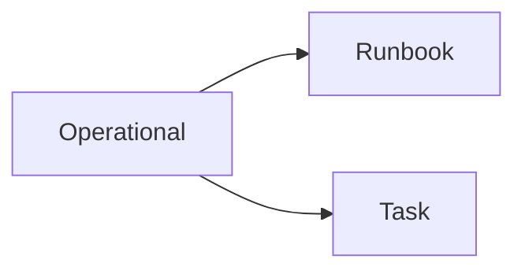

[Home](/) > Operational

# Pillar: Operational

Execution states, incident restoration, and atomic maintenance tasks.



## Sub-directories
- [runbook/](runbook/): Incident response flows mapping symptoms to resolutions.
- [task/](task/): Atomic, idempotent commands for system restoration.

---
## Machine Navigation Metadata
```yaml
type: directory_manifest
pillar: operational
index_map:
  runbook:
    path: runbook/
    scope: Incident response flows.
  task:
    path: task/
    scope: Idempotent maintenance commands.
```
