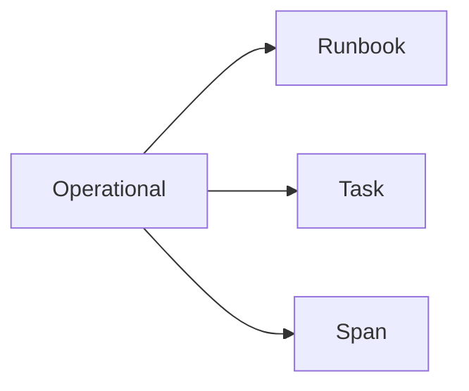

[Home](/) > [Docs](/docs/readme.md) > Operational

# Pillar: Operational

Execution states, incident restoration, and atomic maintenance tasks.


```mermaid
graph LR
    Ops[Operational] --> Run[Runbook]
    Ops --> Task[Task]
    Ops --> Span[Span]
```

## Sub-directories
- [dashboard/](dashboard/): Consolidated diagnostic dashboards for system health monitoring.
- [runbook/](runbook/): Incident response flows mapping symptoms to resolutions.
- [span/](span/): Diagnostics for specific telemetry spans.
- [task/](task/): Atomic, idempotent commands for system restoration.

---
## Machine Navigation Metadata
```yaml
type: directory_manifest
pillar: operational
index_map:
  dashboard:
    path: dashboard/
    scope: Diagnostic dashboards for system health.
  runbook:
    path: runbook/
    scope: Incident response flows.
  task:
    path: task/
    scope: Idempotent maintenance commands.
```
