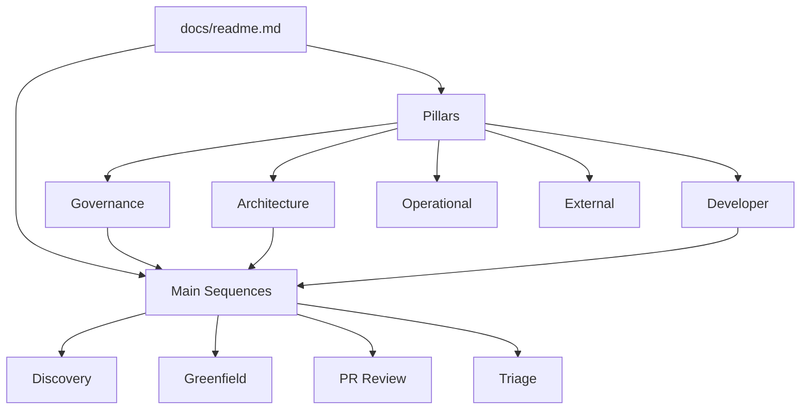

[Home](/) > Docs

# Documentation Pillars

This repository uses a Documentation-as-Code (DaC) model to govern all repository operations and code standards.

## Orchestration Sequences
*Nuance: The definitive entry points for any repository action, whether building, auditing, or fixing.*
- **[Discovery](/docs/governance/protocol/discovery.md):** Map and ingest code shapes for RAG optimization.
- **[Greenfield](/docs/governance/protocol/greenfield.md):** Implement new features with zero scope creep.
- **[PR Review](/docs/governance/protocol/pull-request-review.md):** Mandatory automated and architectural verification.
- **[Triage](/docs/governance/protocol/operational-triage.md):** Rapid mapping of production symptoms to restoration steps.

## Knowledge Pillars
*Nuance: Structured data stores providing the rules, topology, and execution steps for the SDLC.*
- **[Governance](/docs/governance/readme.md)**: Meta-rules, operational protocols, and architectural constraints.
- **[Architecture](/docs/architecture/readme.md)**: System topology, capabilities (T2), and module (T3) definitions.
- **[Developer](/docs/developer/readme.md)**: Code patterns, implementation standards, and human workflows.
- **[Operational](/docs/operational/readme.md)**: Runbooks, restoration tasks, and telemetry mappings.
- **[External](/docs/external/readme.md)**: Consumption strategies and API behavioral expectations.
