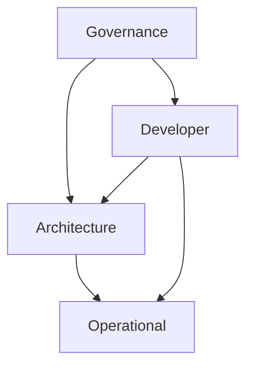

# Repository Root & Knowledge Graph

This repository is governed by an AI-native, RAG-optimized documentation architecture.



## Pillar: Governance (`docs/governance/`)
*Defines the meta-rules and idempotent entry points for agents.*
- `protocol/`: Step-by-step execution scripts for modifying or auditing the system.
- `standard/`: Global constraints applied across the repository layout and metadata.

## Pillar: Architecture (`docs/architecture/`)
*Defines the application topology and business orchestration.*
- `capability/`: Business logic flows and module orchestration sequences (T2).
- `module/`: Physical code clusters, pattern references, and telemetry specs (T3).

## Pillar: Developer (`docs/developer/`)
*Defines the shapes, rules, and human processes for building the system.*
- `pattern/`: Contextless definitions of code geometry and document structures.
- `standard/`: PADU matrices rating patterns against specific operational contexts.
- `workflow/`: Human-centric guides for the SDLC (e.g., "Getting Started", "Pull Requests").

## Pillar: Operational (`docs/operational/`)
*Defines execution states and incident restoration.*
- `runbook/`: Incident response flows mapping telemetry symptoms to resolution tasks.
- `task/`: Atomic, copy-pasteable commands to verify health or restore system state.

## Pillar: External (`docs/external/`)
*Defines system boundaries.*
- `contract/`: API definitions (OpenAPI, GraphQL schemas) exposed to the world.
- `integration/`: Behavioral expectations and SLAs for 3rd party vendors.

---
## Machine Navigation Metadata
```yaml
type: directory_manifest
pillar: root
index_map:
  governance:
    path: docs/governance/
    scope: Meta-rules and idempotent entry points.
  architecture:
    path: docs/architecture/
    scope: Application topology and business orchestration.
  developer:
    path: docs/developer/
    scope: Structural shapes, standards, and human workflows.
  operational:
    path: docs/operational/
    scope: Execution states and incident restoration.
  external:
    path: docs/external/
    scope: API contracts and vendor integration specs.
```

