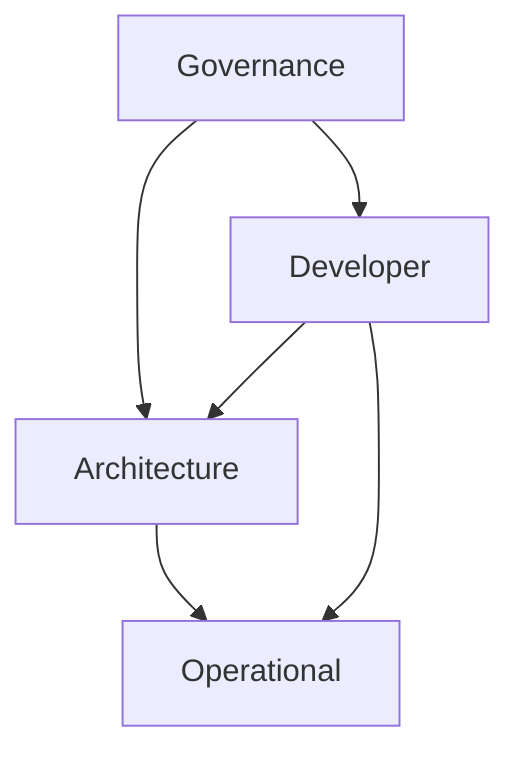

# Space Game — Top-Down Space Faring Engine

A modular 2D space engine featuring Newtonian physics, system-based travel, ship-to-ship combat, a dynamic economy with faction budgets, NPC AI, and procedural ship evolution. Inspired by *Escape Velocity*.

> **For Players** → [Player Manual](docs/external/player-manual.md) · [Weapons Guide](docs/external/weapons.md) · [Modules Guide](docs/external/modules.md) · [Trading Guide](docs/external/trading.md)

## Quick Start

```bash
# 1. Build (native macOS)
brew install sfml box2d entt opentelemetry-cpp
mkdir -p build && cd build && cmake .. && make -j$(sysctl -n hw.ncpu)

# 2. Start observability (Docker)
docker compose up -d

# 3. Run
OTEL_EXPORTER_OTLP_ENDPOINT=http://localhost:4318 ./build/SpaceGame
```

See the full [Getting Started Guide](docs/developer/workflow/getting-started.md) for details on prerequisites, telemetry dashboards, and Docker build validation.

---

## Repository Architecture

This repository is governed by an AI-native, RAG-optimized documentation architecture (Documentation-as-Code).


```mermaid
graph TD
    Gov[Governance] --> Arch[Architecture]
    Gov --> Dev[Developer]
    Arch --> Ops[Operational]
    Dev --> Arch
    Dev --> Ops
```

### Protocol & Governance (`docs/governance/`)
*Meta-rules, operational protocols, and architectural constraints. Entry point for all agentic and human modifications.*
- [Protocol](docs/governance/protocol/): Step-by-step execution scripts for project sequences (Greenfield, Discovery, PR Review).
- [Standard](docs/governance/standard/): Global constraints and pattern ratings (PADU) for structural compliance.

### Topology & Capabilities (`docs/architecture/`)
*System topology, capabilities (T2), and module (T3) definitions. Hierarchical map of the codebase.*
- [Capability](docs/architecture/capability/): Bounded contexts orchestrating multiple modules to deliver business value.
- [Module](docs/architecture/module/): Physical code clusters mapping implementation to architectural requirements.

### Shapes & Workflows (`docs/developer/`)
*The "How-To" for building and maintaining the system. Contextless shapes and human-centric workflows.*
- [Pattern](docs/developer/pattern/): Atomic definitions of code geometry and document structures.
- [Workflow](docs/developer/workflow/): Human-centric guides for the SDLC (Getting Started, Git procedures).

### Recovery & Reliability (`docs/operational/`)
*Artifacts for system uptime, incident restoration, and automated maintenance.*
- [Dashboard](docs/operational/dashboard/): Consolidated diagnostic dashboards for system health monitoring.
- [Runbook](docs/operational/runbook/): Incident response flows mapping telemetry symptoms to resolutions.
- [Task](docs/operational/task/): Atomic, idempotent commands for health verification and recovery.

### Contracts & Boundaries (`docs/external/`)
*API contracts, player-facing documentation, and behavioral expectations for external consumers.*
- [Player Manual](docs/external/player-manual.md): Core game mechanics and fleet logistics guide.
- [Contract](docs/external/contract/): Public interface definitions (OpenAPI, GraphQL).
- [Integration](docs/external/integration/): Vendor SLAs and 3rd party interaction rules.

---
## Machine Navigation Metadata
```yaml
type: directory_manifest
pillar: root
index_map:
  governance:
    path: docs/governance/
    scope: Meta-rules and entry points.
  architecture:
    path: docs/architecture/
    scope: Topology and capabilities.
  developer:
    path: docs/developer/
    scope: Patterns and human workflows.
  operational:
    path: docs/operational/
    scope: Runbooks, dashboards, and restoration tasks.
  external:
    path: docs/external/
    scope: Player guides, API contracts, and vendor SLAs.
```
